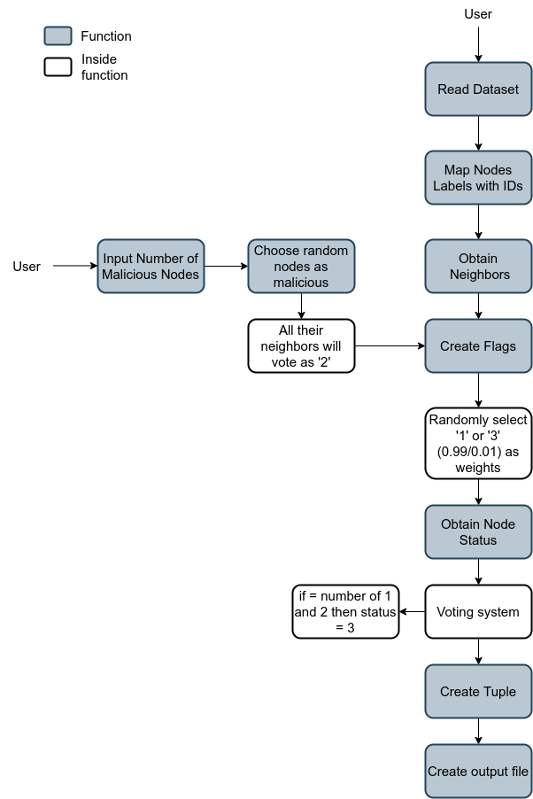

# Data simulator
The main idea of this simulator is to create data as input for the decision engine.

The simulator takes as input a topology dataset (in .gml format) to obtain the neighbors of each node.

## Execution

`python3 main.py -d <dataset.gml>`

this execution generates a file called `output.data ` in the same folder of the main.py file. 
This file should be the input of the decision engine (`driver.py`)

The following diagram shows the execution of the program:

